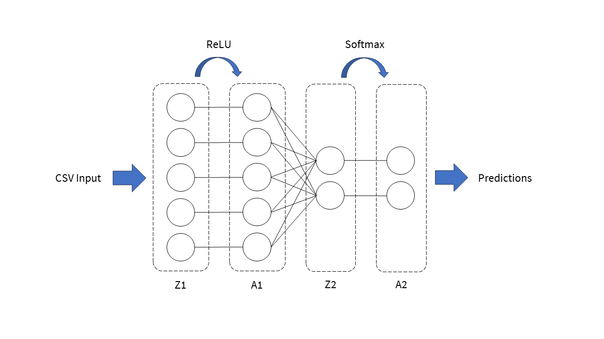
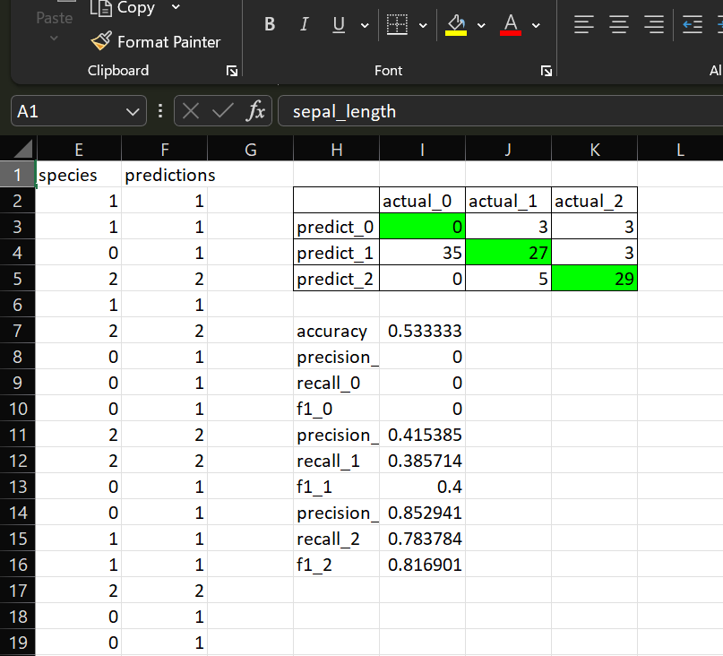

# XCelBoost: Excel Neural Network


*[Devpost](https://devpost.com/software/606786?flow%5Bdata%5D%5Binvitation_key%5D=uENBh4iaTSvxqbgX7sjR&flow%5Bname%5D=accept_software_invitation&ref_content=new_user_added_to_software_team&ref_feature=portfolio&ref_medium=email&utm_campaign=software&utm_content=invitation_to_join_software_team&utm_medium=email&utm_source=transactional)*

Completed with [@casperngeen](https://github.com/casperngeen), [@CreditableX](https://github.com/CreditableX) and [@pqienso](https://github.com/pqienso).

Excel is everyone's favorite app for spreadsheets. From running Doom to 3D physics engines, Excel can do it all. For [Hack&Roll 2024](https://hacknroll.nushackers.org/), we will be implementing a neural network completely within Excel.

### Usage

```
python main.py data/test.csv configs/test.json
```
We have implemented a Python script that converts preprocessed `.csv` files into a neural network. Running `main.py` will generate an `.xlsm` file with our VBA-powered neural network workbook. While initialization is handled by Python, rest assured that all calculations are done in VBA.

### Architecture



For this project, we will work with classification datasets. Our generated model consists of 2 layers, with ReLU as the 1st activation function and softmax as the 2nd. Within each `Iterate` Sub procedure, we complete one pass of forward propagation, backpropagation and gradient descent. The intermediate layers are stored as separate sheets within the workbook.

### Model Performance

|                              |                            |
|------------------------------|----------------------------|
|||

*Model performance on the [Iris dataset](https://www.kaggle.com/datasets/uciml/iris)*

At the end of a training run, our workbook will automatically calculate classification metrics. Unsurprisingly, our model performance is dubious at times. Perhaps this can be improved with proper hyperparameter tuning, and extending our model with more layers.

### What's Next?

There are many possible improvements to our approach. First, more layers and activations can be supported. We can also consider adding a bias term for each layer. Furthermore, we can implement a proper optimization algorithms to improve the process of gradient descent.